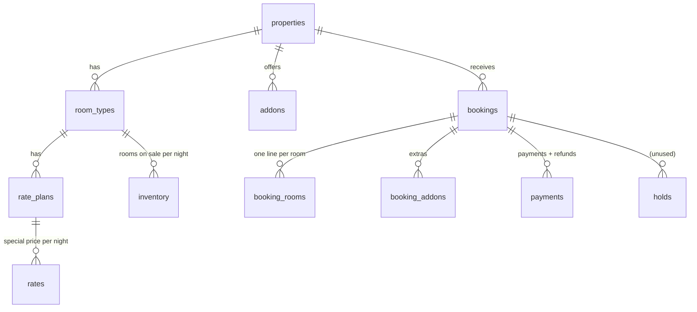

# Data Models
> Purpose: the database, fields, relationships and gotchas | Mode: A | Confidence: High | Related: [../docs/28-DATABASE-AND-DATA-RULES.md](../docs/28-DATABASE-AND-DATA-RULES.md), [backend_spec.md](backend_spec.md)

18 tables in `backend/booking-engine/schema.sql` (MySQL syntax; translated for SQLite by `bin/setup.php`) [CODE].

## Main tables (selected fields)
| Table | Key fields | Notes |
|---|---|---|
| properties | code, name, active, check_in_time 12:00, check_out_time 10:00, website_url, season_start/end, sf_hotel_id | resort active; White Rann Camp `active=0` [CODE] |
| room_types | property_id, name, total_rooms (Kutchi 12, Deluxe 8), base_occupancy 2, max_adults 3, extra_adult_price 1500 | [CODE seed.sql] |
| rate_plans | room_type_id, name, base_price (**double**), single_price | Kutchi 7450/6500, Deluxe 6500/5500 [CODE] |
| rates | rate_plan_id, stay_date, price, min_stay, closed | special prices [CODE] |
| addons | code, name, price, price_type (per_booking/per_person/per_night/per_room_night), min_quantity, tax_rate | transfer-sedan/ertiga/innova, gala-dinner (min 10), candlelight-dinner, birding-jeep [CODE] |
| bookings | ref (KSR-XXXXXX), status pending/confirmed/cancelled, check_in/out, guest_* (name ≤160, phone ≤40, email ≤160, city ≤120), arrival_time ≤40, special_requests TEXT, rooms_subtotal, addons_subtotal, discount, tax_amount, total, amount_paid, payment_mode full/advance, amount_due_now, manage_token, sf_*, cancel_reason ≤255, refund_amount | [CODE] |
| booking_rooms | room_type_id, rate_plan_id, **rate_plan_name "Room with breakfast — Room 2 Double"**, rooms, nightly JSON, subtotal, tax_amount | occupancy lives in the name! [CODE] |
| booking_addons | addon_id, addon_name, quantity, unit_price, subtotal, tax_amount | [CODE] |
| payments | provider razorpay/upi_qr/offline/test, purpose booking/balance/refund, amount (refunds negative), status created/paid/failed/refunded/awaiting_confirmation | [CODE] |
| admin_users | email (= username, e.g. `manvir`), password_hash = **bcrypt(sha256(password))**, role, active | [CODE `admin/login.php`] |
| audit_log | action, entity, entity_id, detail JSON, actor, ip | also rate-limit rows `rl_%` [CODE] |
| enquiries, coupons, packages, package_prices, settings, holds | — | [CODE] |

## Rules and couplings
* `amount_paid` = paid payments − refunds, always via `refresh_amount_paid()` [CODE].
* Occupancy is parsed from `booking_rooms.rate_plan_name` everywhere (`/Room \d+ (Single|Double|Triple)/`) [CODE].
* `nightly` = double price per night used; line subtotal+tax = what the guest pays [CODE].
* Text limits enforced in code (`LIMITS` in `lib/db.php`) because SQLite ignores column sizes [CODE].
* No migrations; re-running full `setup.php` empties rooms/prices/extras (never on live) [CODE `seed.sql` DELETEs].

## Sample records (real database, 29 Sep 2026)
7 bookings: the owner's own KSR-GJKQYG + six **demo** bookings (names start "Demo", emails @example.com; KSR-6JQ9JK was cancelled by the owner while exploring) [CODE `data/booking.sqlite`].
