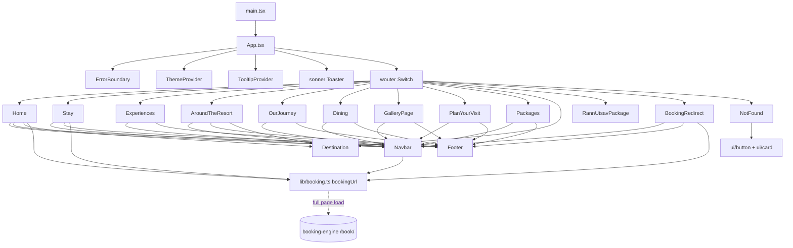

# Architecture, Folders and Setup

_Combined on 30 Sep 2026 from 6 earlier files. Start at [`README.md`](../README.md) for the overview and hard rules._

How the two apps fit together, where every file lives, and how to install and run them.

---

## Contents
* [Architecture](#context-architecture) _(was `context/architecture.md`)_
* [Tech Stack](#context-tech-stack) _(was `context/tech_stack.md`)_
* [Folder Structure](#context-folder-structure) _(was `context/folder_structure.md`)_
* [Environment and Setup](#context-env-and-setup) _(was `context/env_and_setup.md`)_
* [Technical Architecture](#docs-02) _(was `docs/02-ARCHITECTURE.md`)_
* [Component Dependency Map](#docs-18) _(was `docs/18-COMPONENT-DEPENDENCY-MAP.md`)_

---

<a id="context-architecture"></a>

## Architecture
_(was `context/architecture.md`)_
### Components
```mermaid
graph LR
  B[Browser] -->|pages| SITE[frontend/ React SPA<br/>Vite dev :3000 or dist/public]
  SITE -->|plain a href, full page load| ENG[backend/booking-engine PHP<br/>served at /book/]
  B -->|fetch JSON| API[/book/api/*.php/]
  ENG --- API
  API --> DB[(SQLite locally / MySQL live)]
  ADMIN[/book/admin/*.php] --> DB
  API --> RZP[Razorpay]
  API -. off .-> SF[Stayflexi]
  SITE -. optional .-> EXP[backend/server Express<br/>POST /api/contact]
```
* The website and the engine share **no code, session or data**; the site only links to `/book/…` [CODE `frontend/src/lib/booking.ts`].
* In development Vite proxies `/book/` → `http://127.0.0.1:8080` (the PHP built-in server) [CODE `vite.config.ts`]. In production the engine is uploaded to a PHP host at `/book/` [DOC `docs/15`].
* The engine uses relative paths, so it runs under any folder [CODE].

### Data flow: a booking
`availability.php` (read) → `quote.php` (price, no write) → `book.php` (creates a **pending** booking + rooms + extras) → payment (`payment-create.php` → Razorpay/UPI, or `payment-test.php`) → `settle_payment()` (paid → **confirmed**, Stayflexi push, email) [CODE `lib/booking.php`, `lib/payment.php`].
A pending booking holds its rooms for 45 minutes, or while money or a UPI check is pending [CODE `rooms_booked`].

### Key patterns
* **One pricing function** `price_rooms()` for list, checkout, booking and desk changes [CODE `lib/inventory.php`].
* **Difference pricing** for changes (`modification_delta`) [CODE].
* **Money follows payment choice** (`booking_money`) [CODE].
* **Row locks** when creating/changing bookings (MySQL `FOR UPDATE`; SQLite serialises writes) [CODE `for_update()`].
* **Audit log** for every money/inventory action; also stores rate-limit counters [CODE `audit()`, `rate_limit()`].
* **PDFs generated on demand** (never stored) [CODE `lib/documents.php`].

### Scaling and failure
* Single small hotel: 20 cottages; SQLite is fine locally, MySQL on the host [INFERRED].
* Stayflexi down with `fail_closed` → bookings refused rather than oversold [CODE `channel_verify_still_available`].
* Razorpay webhook as backup if the browser closes during payment [CODE `api/webhook-razorpay.php`].
* Mail failure is logged (`mail_failed`), booking still saved [CODE `lib/mail.php`].

---

<a id="context-tech-stack"></a>

## Tech Stack
_(was `context/tech_stack.md`)_
### Website (`frontend/`)
| Tech | Version | Why | Source |
|---|---|---|---|
| React | 19.2 | UI | [CODE `package.json`] |
| Vite | 7 | dev server, build, `/book/` proxy | [CODE `vite.config.ts`] |
| TypeScript | 5.6 | types (`pnpm check`) | [CODE] |
| Tailwind CSS | 4 (config-less, `@theme` in CSS) | styling | [CODE `frontend/src/index.css`] |
| wouter | 3 | tiny router for flat routes | [CODE] |
| lucide-react, sonner, Radix slot/tooltip, cva, clsx, tailwind-merge | — | icons, toasts, shadcn/ui bits | [CODE] |
| Express | 4 | optional server for the built site + `POST /api/contact` | [CODE `backend/server/index.ts`] |
| pnpm | 10 | package manager (npm also works) | [CODE `packageManager`] |

### Booking engine (`backend/booking-engine/`)
| Tech | Why | Source |
|---|---|---|
| PHP 8.3 (8.x) | runs on any cPanel host, no build step | [CODE], [DOC `docs/20`] |
| PDO: SQLite (local) / MySQL (live) | one schema for both | [CODE `lib/db.php`, `bin/setup.php`] |
| cURL | Razorpay, Stayflexi | [CODE] |
| Built-in PDF writer | receipts/terms without a library | [CODE `lib/pdf.php`] |
| PDF.js (cdnjs) | show PDFs in the tab, never download | [CODE `document.php`] |
| qrious (CDN) | draw the UPI QR | [CODE `assets/engine.js`] |
| Razorpay Checkout (CDN) | card/UPI/netbanking | [CODE] |
| Google Fonts: Marcellus, Montserrat | engine look | [CODE] |

### Services
| Service | Use | State |
|---|---|---|
| Razorpay | online payments, refunds | test keys on this PC; live keys exist (secret to regenerate) [DOC `docs/26`] |
| Stayflexi | channel manager (OTAs) | off; endpoints unverified [CODE `config.php`] |
| Vercel | website hosting (`kutchsafaribhuj.in`) | [DOC `docs/15`] |
| PHP host (cPanel) | engine + MySQL | [PLANNED] not deployed |
| SMTP | confirmation emails | [PLANNED] not set |

---

<a id="context-folder-structure"></a>

## Folder Structure
_(was `context/folder_structure.md`)_
Reorganised on 29 Sep 2026 (`client/` → `frontend/`, `booking-engine/` → `backend/booking-engine/`, `server/` → `backend/server/`) [CODE [`restructure/CHANGELOG.md`](09-HISTORY-TESTING-AND-GO-LIVE.md#restructure-changelog)].

```
kutch-safari-resort/
├── frontend/                  React website (Vite root)                       [CODE vite.config.ts]
│   ├── index.html             entry HTML (meta, fonts, favicon)
│   ├── public/                served at / : assets/ (images, video, images/brochure/ from the 2026–27 PDF), favicon.ico, robots.txt, sitemap.xml, vercel.json
│   └── src/
│       ├── main.tsx           ENTRY: mounts <App/>
│       ├── App.tsx            routes + page titles
│       ├── components/        Navbar, Footer, ErrorBoundary, ui/ (shadcn)
│       ├── lib/booking.ts     bookingUrl / statusUrl / adminUrl — the only link to the engine
│       └── pages/             one file per route
├── backend/
│   ├── booking-engine/        PHP engine, served at /book/
│   │   ├── index.php          ENTRY (guest booking page)   manage.php (check status)
│   │   ├── document.php, receipt.php, terms.php   PDFs
│   │   ├── api/               JSON endpoints (_init.php shared)
│   │   ├── admin/             staff panel (_auth.php shared: session, head, confirm box)
│   │   ├── lib/               db, inventory (pricing/availability), booking, payment, channel, mail, pdf, documents
│   │   ├── bin/               CLI: setup, test-changes, check-system, sync/retry (cron), Stayflexi tools
│   │   ├── assets/            engine.js, engine.css, icon.svg, img/
│   │   ├── config.php         all settings;  config.local.php (git-ignored) = secrets + local overrides
│   │   ├── schema.sql, seed.sql
│   │   └── data/              booking.sqlite (git-ignored)
│   └── server/index.ts        Express server for the built site
├── api/contact.ts             Vercel function (must stay at the root)
├── README.md                  start here: overview, hard rules, quick start
├── docs/                      the 9 project docs (01–09); every other .md was merged into these on 30 Sep 2026
├── chaos/EVIDENCE/            scripts from the 29 Sep chaos test (reports are in docs/09)
├── scripts/legacy/            old one-off *.py edit scripts (unused; do not run)
└── package.json, vite.config.ts, tsconfig.json, components.json, .gitignore, …
```

### Where to put new code
* New website page → `frontend/src/pages/X.tsx` + route in `App.tsx` + title in `TITLES` + `public/sitemap.xml` [CODE].
* New engine endpoint → `backend/booking-engine/api/x.php` starting with `require_once __DIR__ . '/_init.php';` [CODE].
* Business logic → `backend/booking-engine/lib/` (not in pages/endpoints) [CODE pattern].
* New admin screen → `admin/x.php` with `require_login()`, `check_csrf()`, `admin_head()` / `admin_foot()` [CODE].
* Git-ignored and never committed: `config.local.php`, `data/*.sqlite`, `/data/`, `dist/`, `node_modules/` [CODE `.gitignore`].

---

<a id="context-env-and-setup"></a>

## Environment and Setup
_(was `context/env_and_setup.md`)_
### Prerequisites
* Node 18+ and pnpm (or npm) [CODE `package.json`].
* PHP 8.x with `pdo_sqlite`, `sqlite3`, `curl`, `mbstring`, `openssl`, `fileinfo`; `date.timezone = Asia/Kolkata`. On this PC: PHP 8.3 via winget [DOC `docs/15`].

### Install and run (local)
```bash
pnpm install
pnpm setup:book      # once: php backend/booking-engine/bin/setup.php → creates data/booking.sqlite
pnpm dev:book        # php -S 127.0.0.1:8080 -t backend/booking-engine
pnpm dev             # vite on :3000; /book/ → 127.0.0.1:8080
```
Open http://localhost:3000 (site), /book/ (booking), /book/manage.php (status), /book/admin (admin) [CODE].
Create/reset an admin: `php backend/booking-engine/bin/setup.php --admin USERNAME "Name" "password"` [CODE].

### Settings (`backend/booking-engine/config.php`, overridden by `config.local.php`)
| Setting | Purpose | Example (non-secret) |
|---|---|---|
| `db.driver` | `sqlite` (default) or `mysql` | live: `mysql` in config.local.php |
| `db.host/name/user/pass` | MySQL connection | `localhost`, `kutch_booking`, … |
| `db.sqlite_path` | SQLite file | `data/booking.sqlite` |
| `base_url` | engine's own URL | `http://localhost:3000/book` |
| `razorpay.enabled/key_id/key_secret/webhook_secret` | payments | `rzp_test_…` (secret only in config.local.php) |
| `upi.enabled/vpa/payee_name/hold_minutes` | UPI QR | vpa empty (not set) |
| `test_payments.enabled` | "I've paid (test)" button | `true` now; `false` for launch |
| `rules.*` | max_nights 21, max_rooms_online 5, max_days_ahead 730, max_extra_quantity 50, hold_minutes 20, guest_details_optional (true now) | |
| `payment_modes`, `cancellation`, `tax_slabs`, `prices_include_tax` | money rules | see [backend_spec.md](05-BOOKING-ENGINE.md#context-backend-spec) |
| `stayflexi.*` | channel manager | `enabled: false` |
| `mail.*` | from/bcc, SMTP | SMTP off |
| `admin.idle_minutes/list_clear_days/login_attempts` | 10 / 15 / 6 | |
| `allowed_origins`, `debug`, `timezone` | CORS, error detail, IST | |
Website: `VITE_BOOKING_URL` (build time; default `/book/`) [CODE `lib/booking.ts`].

### Common setup errors
| Symptom | Cause | Fix |
|---|---|---|
| Rooms never load (spinner) | Vite proxy hit IPv6 `localhost` | engine on `127.0.0.1:8080` (as configured) [DOC `docs/29`] |
| Razorpay "HTTP 0" on Windows | no CA bundle | `curl_trust_system_certs()` (already in code) |
| `/book/admin` broken layout | missing trailing slash | redirect in `_auth.php` (fixed) |
| Port 8080 in use | a previous PHP server | stop it, or reuse |
| `NODE_ENV=production` fails in cmd | Unix-style env in `pnpm start` | use Git Bash / Linux host |

---

<a id="docs-02"></a>

## Technical Architecture
_(was `docs/02-ARCHITECTURE.md`)_
### 1. High-Level Architecture

Two independent applications live in one repository:

```
                    ┌─────────────────────────────────────────┐
 Browser ──HTTPS──► │ Marketing site (React SPA, dist/public) │  Vercel / Express
                    │   POST /api/contact  → data/enquiries   │
                    └───────────────┬─────────────────────────┘
                                    │  <a href="/book/?property=…">  (full page load)
                                    ▼
                    ┌─────────────────────────────────────────┐
                    │ Booking engine (backend/booking-engine) │  PHP host, e.g. cPanel /book
                    │   index.php, manage.php, api/*.php      │
                    │   admin/*.php                           │──► MySQL (SQLite locally)
                    │   Razorpay · UPI QR · Stayflexi         │
                    └─────────────────────────────────────────┘
```

* The React site only **links** to the engine. It shares no code, data or session with it.
* The engine's pages use relative paths (`assets/…`, `api/…`), so it runs unchanged under any folder, e.g. `/book/`.

---

### 2. Directory Structure

```text
kutch-safari-resort/
├── frontend/
│   ├── index.html              # SPA shell, meta tags, fonts
│   ├── public/                 # static files served at / (assets/, robots.txt, sitemap.xml, vercel.json)
│   └── src/
│       ├── App.tsx             # routes
│       ├── main.tsx            # mount point
│       ├── index.css           # Tailwind 4 theme + custom classes
│       ├── components/         # Navbar, Footer, ErrorBoundary, ui/ (button, card, sonner, tooltip)
│       ├── contexts/           # ThemeContext
│       ├── lib/
│       │   ├── utils.ts        # cn()
│       │   └── booking.ts      # BOOKING_URL + bookingUrl() — links into the engine
│       └── pages/              # one file per route (see 03-ROUTING-AND-NAVIGATION.md)
├── backend/
│   ├── booking-engine/         # PHP + MySQL booking engine (own README.md)
│   │   ├── config.php          # every setting; overridden by config.local.php (git-ignored)
│   │   ├── index.php, manage.php   # guest booking flow, "Already booked? Check status"
│   │   ├── document.php, receipt.php, terms.php   # receipt / terms PDFs (shown in the tab with PDF.js)
│   │   ├── api/                # JSON endpoints used by assets/engine.js
│   │   ├── admin/              # staff panel: bookings, booking, edit (change), calendar (availability), rates (special prices), enquiries, export
│   │   ├── lib/                # db, inventory/pricing, booking (+ change pricing, money), payment, channel, mail, pdf, documents
│   │   ├── bin/                # setup, cron, health checks, test-changes.php (CLI only)
│   │   ├── assets/             # engine.css, engine.js, WebP room photos
│   │   ├── schema.sql, seed.sql    # database + starting data
│   │   └── data/               # SQLite file in local dev (git-ignored except .htaccess)
│   └── server/index.ts         # Express: static files, POST /api/contact, SPA fallback
├── api/contact.ts              # Vercel function (logs only); stays at the root because Vercel only reads /api there
├── docs/                       # the 9 project docs (01–09)
├── scripts/legacy/             # the old one-off *.py edit scripts and old_rooms.tsx (unused, kept for history)
├── restructure/                # records of the 29 Sep 2026 folder cleanup
├── vite.config.ts, tsconfig.json, components.json, package.json
└── dist/, data/, node_modules/ # build output, Express enquiries, packages (all git-ignored)
```

Moved on 29 Sep 2026: `client/` → `frontend/`, `booking-engine/` → `backend/booking-engine/`, `server/` → `backend/server/`. See [`restructure/REPORT.md`](09-HISTORY-TESTING-AND-GO-LIVE.md#restructure-report).

---

### 3. Build Pipeline

#### 3.1 Vite 7
* Root is `frontend/`; output goes to `dist/public`.
* Alias: `@/` → `frontend/src/`.
* **Dev proxy:** `/book/` → `http://localhost:8080` with the `/book` prefix stripped. This lets `pnpm dev` show the engine on the same origin.

#### 3.2 Server bundle
`pnpm build` runs `vite build` and then bundles `backend/server/index.ts` with esbuild into `dist/index.js`.

#### 3.3 Booking engine
It has no build step. Upload the folder as it is. Run `php bin/setup.php` once to create tables and load `seed.sql`.

#### 3.4 TypeScript
`pnpm check` (`tsc --noEmit`) covers `frontend/src`, `backend/server` and `api`. The PHP engine is not part of it.

---

### 4. Application Logic

#### 4.1 Routing
wouter `<Switch>` in `App.tsx`. `/booking`, `/book` and `/book/*` render `BookingRedirect`, which does a full-page redirect to `bookingUrl()`. If the SPA itself is answering `/book/` (the engine isn't deployed on that host), it shows call/WhatsApp buttons instead of looping.

#### 4.2 State
Local `useState` only. There is no global store. `ThemeContext` is fixed to light.

#### 4.3 Error handling
`ErrorBoundary` wraps the app. It shows the error stack and a reload button.

#### 4.4 Express server
* `express.static(dist/public)`
* `POST /api/contact` appends the request body to `data/enquiries.json` (root `/data/`, git-ignored). The front end does not call it yet.
* `GET *` returns `index.html`.

#### 4.5 Booking engine internals (summary)
* `lib/inventory.php` handles availability and pricing: `price_rooms()` (one function for every price; Single/Double/Triple per room), special prices per night in `rates`, GST per night (inclusive for the resort via `tax_split()`), and which bookings hold rooms (`rooms_booked()`). See docs 21 and 23.
* `lib/booking.php` handles quote, create, cancel (ladder from `config.php`), desk changes priced as a difference (`quote_modification()` → `modification_delta()`), and what is owed by payment choice (`booking_money()`). See doc 22.
* `lib/pdf.php` + `lib/documents.php` build the receipt and terms PDFs on the spot. Nothing is stored.
* `lib/payment.php` handles Razorpay orders, signature and webhook verification, the UPI QR (confirmed manually in admin), test payments, and payments/refunds taken at the desk. `amount_paid` = payments − refunds everywhere. See doc 26.
* `lib/channel.php` is the Stayflexi adapter. It is off by default. Its endpoint paths are unconfirmed guesses. See doc 27.
* Data lives in 18 tables (`schema.sql`, see doc 28): properties, room_types, rate_plans, rates, inventory, addons, packages, package_prices, bookings, booking_rooms, booking_addons, payments, holds, enquiries, coupons, admin_users, audit_log, settings.

---

### 5. Security & Performance
* The engine's `.htaccess` blocks `config*.php`, `*.sql`, `*.sqlite`, `*.md`, `data/` and `bin/`, and forces HTTPS. It only works on Apache. Other hosts need equivalent rules.
* Real keys go in `backend/booking-engine/config.local.php`, which is git-ignored. Set `debug => false` in production.
* Admin sign-in: session cookie only (ends when the browser closes), per-tab, 10-minute idle timeout, 6 login attempts per 15 minutes. `bin/` is CLI-only (`test-changes.php` refuses to run from the web).
* CORS: the engine only answers origins listed in `allowed_origins` in `config.php`. The kutchsafaribhuj.in domains and localhost:3000 are included.
* `/api/contact` does not validate or sanitise input.
* Performance: `frontend/public/assets` is about 269 MB of unoptimised media (see [`11-IMAGE-ASSET-INVENTORY.md`](03-DESIGN-AND-ASSETS.md#docs-11)). The engine's own photos are already WebP (3.1 MB in total).

---

<a id="docs-18"></a>

## Component Dependency Map
_(was `docs/18-COMPONENT-DEPENDENCY-MAP.md`)_
_Updated 30 Sep 2026._

### 1. React site



`Destination` and `RannUtsavPackage` import neither `Navbar` nor `Footer`. They have their own markup.

### 2. Per-file imports
| File | Imports |
|---|---|
| `App.tsx` | wouter (`useLocation` for `usePageTitle`), ErrorBoundary, ThemeContext, ui/sonner, ui/tooltip, all pages, `adminUrl` |
| `Navbar.tsx` | wouter `Link`/`useLocation`, lucide `Menu`/`X`/`Instagram`, `bookingUrl`, `statusUrl` |
| `Footer.tsx` | wouter `Link`, lucide `Instagram`, `statusUrl` |
| `Home.tsx` | wouter, sonner `toast`, lucide (several unused), Navbar, Footer, `bookingUrl`, `statusUrl` |
| `Stay.tsx` | lucide amenity icons, Navbar, Footer, `bookingUrl` |
| `Experiences.tsx` | lucide `Car`, `Footprints`, `Map`, `Shirt`, `Stethoscope`, `UserRound`, `Wifi`, `PawPrint`, `MessageCircle`, Navbar, Footer; images from `/assets/images/brochure/` |
| `AroundTheResort.tsx` | wouter `Link`, lucide `ArrowRight`, Navbar, Footer (links to `/destination/:slug`) |
| `Destination.tsx` | wouter `Link`/`useRoute`, many lucide icons (most unused) |
| `RannUtsavPackage.tsx` | wouter `Link`, lucide icons |
| `BookingRedirect.tsx` | lucide `Phone`/`MessageCircle`, Navbar, Footer, `bookingUrl` |
| `NotFound.tsx` | ui/button, ui/card, lucide, wouter `useLocation` |
| OurJourney, Dining, Gallery, PlanYourVisit, Packages | Navbar, Footer |

### 3. Booking engine (PHP)
```
index.php / manage.php ──► assets/engine.js ──fetch──► api/*.php
                                                   │
api/_init.php (CORS, JSON, rate limit) ─► lib/db.php ─► config.php (+ config.local.php)
api/quote|availability ─► lib/inventory.php
api/book|booking-* ─────► lib/booking.php ─► lib/inventory.php, lib/channel.php, lib/mail.php
api/payment-*|webhook ──► lib/payment.php ─► lib/booking.php
admin/*.php ─► admin/_auth.php ─► lib/*        (_auth.php also: /admin → /admin/ redirect, per-tab sign-in, on-page confirm box)
admin/edit.php ─► lib/booking.php quote_modification → modification_delta, booking_money; modify_booking
admin/calendar.php ─► lib/inventory.php + lib/booking.php booking_money
document.php ─► receipt.php / terms.php ─► lib/documents.php ─► lib/pdf.php   (PDF.js from cdnjs shows it in the tab)
bin/*.php (CLI) ─► lib/*                        (bin/test-changes.php: tests on a temp copy of the database)
```

Pricing chain: `api/availability` → `search_availability()` → `price_rooms()` → `price_rate_plan()` (`rates` special prices, `pricing_locks()` during a change) → `tax_split()`. The checkout, booking and desk changes all use the same `price_rooms()`.

### 4. Third-party
* **Site:** react 19, wouter 3, lucide-react, sonner, @radix-ui (slot, tooltip), cva, clsx, tailwind-merge, next-themes (installed; ThemeContext doesn't use it), express.
* **Engine:** PHP PDO (MySQL/SQLite), cURL (Razorpay, Stayflexi), Razorpay Checkout (CDN, loaded only when enabled), qrious 4.0.2 (CDN, UPI QR), PDF.js (cdnjs, to show PDFs in the tab), Google Fonts (Marcellus, Montserrat). No PHP libraries: the PDF writer is built in.
