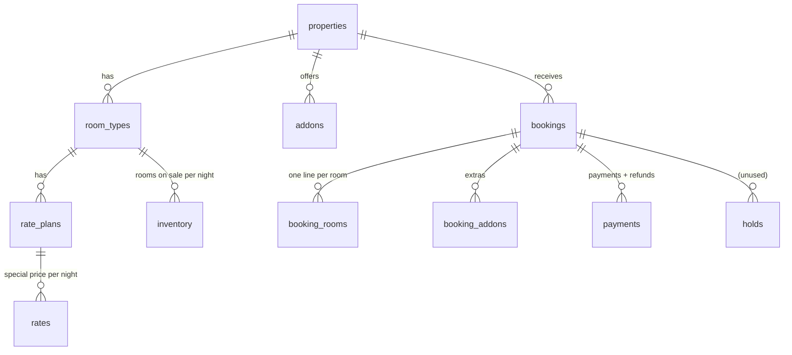

# Database and Data Rules

_Combined on 30 Sep 2026 from 2 earlier files. Start at [`README.md`](../README.md) for the overview and hard rules._

The tables, hidden couplings between them, and the rules for real vs test/demo data.

---

## Contents
* [Data Models](#context-data-models) _(was `context/data_models.md`)_
* [Database and Data Rules](#docs-28) _(was `docs/28-DATABASE-AND-DATA-RULES.md`)_

---

## Data Models
_(was `context/data_models.md`)_
18 tables in `backend/booking-engine/schema.sql` (MySQL syntax; translated for SQLite by `bin/setup.php`) [CODE].

### Main tables (selected fields)
| Table | Key fields | Notes |
|---|---|---|
| properties | code, name, active, check_in_time 12:00, check_out_time 10:00, website_url, season_start/end, sf_hotel_id | resort active; White Rann Camp `active=0` [CODE] |
| room_types | property_id, name, total_rooms (Kutchi 12, Deluxe 8), base_occupancy 2, max_adults 3, extra_adult_price 1500 | [CODE seed.sql] |
| rate_plans | room_type_id, name, base_price (**double**), single_price | Kutchi 7450/6500, Deluxe 6500/5500 [CODE] |
| rates | rate_plan_id, stay_date, price, min_stay, closed | special prices [CODE] |
| addons | code, name, price, price_type (per_booking/per_person/per_night/per_room_night), min_quantity, tax_rate | transfer-sedan/ertiga/innova, gala-dinner (min 10), candlelight-dinner, birding-jeep [CODE] |
| bookings | ref (KSR-XXXXXX), status pending/confirmed/cancelled, check_in/out, guest_* (name ≤160, phone ≤40, email ≤160, city ≤120), arrival_time ≤40, special_requests TEXT, rooms_subtotal, addons_subtotal, discount, tax_amount, total, amount_paid, payment_mode full/advance, amount_due_now, manage_token, sf_*, cancel_reason ≤255, refund_amount | [CODE] |
| booking_rooms | room_type_id, rate_plan_id, **rate_plan_name "Room with breakfast — Room 2 Double"**, rooms, nightly JSON, subtotal, tax_amount | occupancy lives in the name! [CODE] |
| booking_addons | addon_id, addon_name, quantity, unit_price, subtotal, tax_amount | [CODE] |
| payments | provider razorpay/upi_qr/offline/test, purpose booking/balance/refund, amount (refunds negative), status created/paid/failed/refunded/awaiting_confirmation | [CODE] |
| admin_users | email (= username, e.g. `manvir`), password_hash = **bcrypt(sha256(password))**, role, active | [CODE `admin/login.php`] |
| audit_log | action, entity, entity_id, detail JSON, actor, ip | also rate-limit rows `rl_%` [CODE] |
| enquiries, coupons, packages, package_prices, settings, holds | — | [CODE] |

### Rules and couplings
* `amount_paid` = paid payments − refunds, always via `refresh_amount_paid()` [CODE].
* Occupancy is parsed from `booking_rooms.rate_plan_name` everywhere (`/Room \d+ (Single|Double|Triple)/`) [CODE].
* `nightly` = double price per night used; line subtotal+tax = what the guest pays [CODE].
* Text limits enforced in code (`LIMITS` in `lib/db.php`) because SQLite ignores column sizes [CODE].
* No migrations; re-running full `setup.php` empties rooms/prices/extras (never on live) [CODE `seed.sql` DELETEs].

### Sample records (real database, 29 Sep 2026)
7 bookings: the owner's own KSR-GJKQYG + six **demo** bookings (names start "Demo", emails @example.com; KSR-6JQ9JK was cancelled by the owner while exploring) [CODE `data/booking.sqlite`].

---

## Database and Data Rules
_(was `docs/28-DATABASE-AND-DATA-RULES.md`)_
_Written 26 Sep 2026. Schema: `backend/booking-engine/schema.sql` (18 tables). Starting data: `seed.sql`. MySQL in production, SQLite on this PC (`backend/booking-engine/data/booking.sqlite`, chosen in `config.local.php`)._

### 1. Tables
| Table | Holds |
|---|---|
| `properties` | Kutch Safari Resort (active) and White Rann Camp (**`active = 0`**, switched off): times, season, accent colour, `website_url`, Stayflexi hotel id |
| `room_types` | Kutchi AC Cottage (12), Deluxe AC Cottage (8), camp tents: `total_rooms`, `base_occupancy` 2, `max_adults` 3, `extra_adult_price` (₹1,500 extra bed) |
| `rate_plans` | One "Room with breakfast" plan per cottage: `base_price` = **double**, `single_price` |
| `rates` | **Special prices**: one row per plan per night (`price`, `min_stay`, `closed`) |
| `inventory` | Rooms on sale per type per night (`rooms_open`), from Stayflexi. Empty = all rooms on sale |
| `addons` | Extras: `price`, `price_type`, `min_quantity`, `tax_rate`, `active` |
| `packages`, `package_prices` | Colors of Kutch (enquiry only) |
| `bookings` | One row per booking: ref, status (`pending` / `confirmed` / `cancelled`), dates, guest, `arrival_time`, money totals, `amount_paid`, `payment_mode`, `amount_due_now`, `manage_token`, Stayflexi fields, cancel fields |
| `booking_rooms` | One line **per room** (see §2) with `nightly` JSON, `subtotal`, `tax_amount` |
| `booking_addons` | Extras on a booking: `quantity`, `unit_price`, `subtotal`, `tax_amount` |
| `payments` | Every payment attempt, payment and refund (`provider`: razorpay / upi_qr / offline / test; `purpose`: booking / balance / refund) |
| `holds` | Short stock holds (not used by the current checkout) |
| `enquiries` | From `api/enquiry.php` |
| `coupons` | Discount codes |
| `admin_users` | Staff logins (the `email` column holds the **username**, e.g. `manvir`) |
| `audit_log` | Everything that matters (below) |
| `settings` | Small editable texts (engine name, terms URL, peak-dates note) |

### 2. Hidden couplings (read before changing anything)
* **Occupancy lives in the line name.** `booking_rooms.rate_plan_name` is e.g. `"Room with breakfast — Room 2 Double"`. The admin, the change screen, the calendar, the receipt and the change pricing all read "Single/Double/Triple" back out of it with a pattern (`/Room \d+ (Single|Double|Triple)/`). There is no separate occupancy column. Changing that text format breaks them. (The column was widened to 255 for this.)
* **Room numbers are positions** in the booking, not cottage numbers (doc 23).
* **`nightly`** (JSON `{date: price}`) is the **double** price per night that was used, before the single/extra-bed adjustment. The line's `subtotal + tax_amount` is what the guest actually pays for that room.
* **Extras are grouped by name.** "Airport transfer, one way — Innova": the part before " — " is the group, the part after is the car. The booking page groups on it, and the Availability panel reads the car from it.
* **Per-room extras** append " — Room N" to the line name.
* **`amount_paid`** is always paid payments − refunds (`refresh_amount_paid()`). Never set it by hand.
* **`amount_due_now`** is what was asked for at checkout. It does not change after a desk change (doc 22).
* **`audit_log`** also holds the **rate-limit counters** (`rl_avail`, `rl_book`, `rl_quote`…, one row per request). It is not only history, so it grows; it can be trimmed of old `rl_%` rows.
* `booking_modified` audit rows keep the change breakdown (`changes`) that the booking page shows after saving.

### 3. No invented data
The owner's rule: **no synthetic data** in the real database. It must be real, and the owner adds it.
* Never insert sample bookings, guests or payments into `data/booking.sqlite`.
* Blank guest fields are stored blank, never "Guest" or "N/A". The arrival-time wheel sends nothing until the guest turns it.
* **All tests run on a throwaway copy** of the database, deleted afterwards (doc 30).
* On 26 Sep 2026 the owner's three test bookings (KSR-2WQG3X, KSR-3E95RT, KSR-RKJL4F) were deleted with their rooms, extras and payments at the owner's request. The audit history was kept (owner's choice earlier).
* **Exception, 29 Sep 2026:** the owner asked for 5–6 demo bookings to explore the site. Six were added (KSR-9ED7VS staying now, KSR-6CX43U arriving today 50% paid, KSR-6JQ9JK coming up with 3 rooms, KSR-LL6CZZ waiting for UPI, KSR-NZQNSB changed by the desk with a balance due, KSR-Z8P7X6 cancelled). Every guest name starts with "Demo" and every email ends in @example.com, so they can be removed by that pattern. A backup of the database from just before was kept outside the project. With the owner's own KSR-GJKQYG that makes 7 bookings.
* **Text limits** (29 Sep 2026): SQLite ignores column sizes, MySQL refuses longer values. `lib/db.php` → `LIMITS` enforces them in code for every form: name 120, email 160, city 80, guest note 2,000, enquiry message 3,000, staff notes 2,000, payment note 300, cancel reason 250; phone 7–15 digits; arrival time "h:mm AM/PM".

### 4. Schema changes, and a warning about setup
**Since 4 Oct 2026 `setup.php` guards against this:**
* Unknown options are refused.
* A full setup on a database that has bookings is refused unless `--reset` is given.
* If any statement fails, it reports FAILED rather than "Ready".

With `--reset` on a database that has bookings, the reload still half-applies (properties cannot be deleted while bookings point at them), so treat `--reset` as test-copy-only.

**Re-running `php bin/setup.php` (without `--admin`) reloads `seed.sql`, which first empties `properties`, `room_types`, `rate_plans`, `rates` (special prices), `inventory`, `addons`, `packages` and `package_prices`.** Prices changed in the admin, special prices and extras would be lost, and White Rann Camp comes back as it is in the seed (switched off). Bookings and payments are not in that list, but they point at room types by id. **Never re-run full setup on the live database.** `--admin` on its own is safe.

There are **no migration scripts**. `bin/setup.php` creates missing tables (`CREATE TABLE IF NOT EXISTS`). Columns added during this project (`rate_plans.single_price`, `addons.min_quantity`, wider `booking_rooms.rate_plan_name`) are in `schema.sql`, so a fresh install has them. An **older existing** database needs them added by hand (`ALTER TABLE …`).

### 5. SQLite vs MySQL
The code works with both (PDO). Differences handled in `lib/db.php`: `for_update()` adds `FOR UPDATE` on MySQL only (SQLite locks the whole file). Dates are stored as `YYYY-MM-DD` / `YYYY-MM-DD HH:MM:SS` text in Indian time (`config.php → timezone = Asia/Kolkata`).
