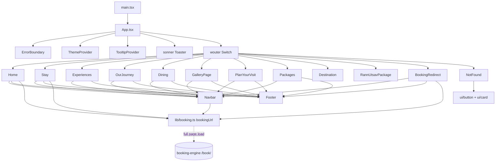

# Component Dependency Map

## 1. React site



`Destination` and `RannUtsavPackage` import neither `Navbar` nor `Footer`. They have their own markup.

## 2. Per-file imports
| File | Imports |
|---|---|
| `App.tsx` | wouter, ErrorBoundary, ThemeContext, ui/sonner, ui/tooltip, all pages |
| `Navbar.tsx` | wouter `Link`/`useLocation`, lucide `Menu`/`X`, `bookingUrl` |
| `Footer.tsx` | wouter `Link`, lucide `Instagram` |
| `Home.tsx` | wouter, sonner `toast`, lucide (several unused), Navbar, Footer, `bookingUrl` |
| `Stay.tsx` | lucide amenity icons, Navbar, Footer, `bookingUrl` |
| `Experiences.tsx` | wouter `Link`, lucide `ArrowRight`, Navbar, Footer |
| `Destination.tsx` | wouter `Link`/`useRoute`, many lucide icons (most unused) |
| `RannUtsavPackage.tsx` | wouter `Link`, lucide icons |
| `BookingRedirect.tsx` | lucide `Phone`/`MessageCircle`, Navbar, Footer, `bookingUrl` |
| `NotFound.tsx` | ui/button, ui/card, lucide, wouter `useLocation` |
| OurJourney, Dining, Gallery, PlanYourVisit, Packages | Navbar, Footer |

## 3. Booking engine (PHP)
```
index.php / manage.php ──► assets/engine.js ──fetch──► api/*.php
                                                   │
api/_init.php (CORS, JSON, rate limit) ─► lib/db.php ─► config.php (+ config.local.php)
api/quote|availability ─► lib/inventory.php
api/book|booking-* ─────► lib/booking.php ─► lib/inventory.php, lib/channel.php, lib/mail.php
api/payment-*|webhook ──► lib/payment.php ─► lib/booking.php
admin/*.php ─► admin/_auth.php ─► lib/*        (_auth.php also: /admin → /admin/ redirect, per-tab sign-in, on-page confirm box)
admin/edit.php ─► lib/booking.php quote_modification → modification_delta, booking_money; modify_booking
admin/calendar.php ─► lib/inventory.php + lib/booking.php booking_money
document.php ─► receipt.php / terms.php ─► lib/documents.php ─► lib/pdf.php   (PDF.js from cdnjs shows it in the tab)
bin/*.php (CLI) ─► lib/*                        (bin/test-changes.php: tests on a temp copy of the database)
```

Pricing chain: `api/availability` → `search_availability()` → `price_rooms()` → `price_rate_plan()` (`rates` special prices, `pricing_locks()` during a change) → `tax_split()`. The checkout, booking and desk changes all use the same `price_rooms()`.

## 4. Third-party
* **Site:** react 19, wouter 3, lucide-react, sonner, @radix-ui (slot, tooltip), cva, clsx, tailwind-merge, next-themes (installed; ThemeContext doesn't use it), express.
* **Engine:** PHP PDO (MySQL/SQLite), cURL (Razorpay, Stayflexi), Razorpay Checkout (CDN, loaded only when enabled), qrious 4.0.2 (CDN, UPI QR), PDF.js (cdnjs, to show PDFs in the tab), Google Fonts (Marcellus, Montserrat). No PHP libraries: the PDF writer is built in.
